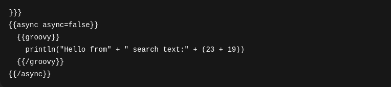
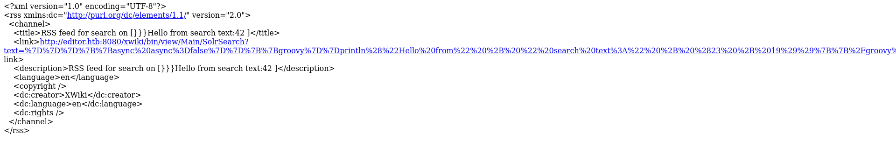

Editor - HTB Writeup

This was an easy difficulty box that involved exploitation of aplication called xwiki. 
First thing first i started with port scan that revealed ssh,http and http proxy.
I visited the http domain editor.htb there was not much found except the application i could download. 
I was thinking of exploring the binary of this application but i don't know what i would be looking for actually so i hold on with that.
But i explored the 8080 xwiki interface and found out its version.
I searched up if it is vulnerable. And it has a known RCE vulnerability going by CVE-2025-24893.
This involved visiting this url <host>/xwiki/bin/get/Main/SolrSearch?media=rss&text=%7D%7D%7D%7B%7Basync%20async%3Dfalse%7D%7D%7B%7Bgroovy%7D%7Dprintln%28"Hello%20from"%20%2B%20"%20search%20text%3A"%20%2B%20%2823%20%2B%2019%29%29%7B%7B%2Fgroovy%7D%7D%7B%7B%2Fasync%7D%7D%20#L42
that url decoded looked slike this:

And after sending this request i recieved a file to download and inside the i found 43 wich means the payload numbers were summed therefore the payload got executed.

So now that the payload was executed came time to spawn the reverse shell.
Tough inserting the url encoded reverse shell in place of payload should have worked it didn't.
Luckily there is a POC at github https://github.com/IIIeJlyXaKapToIIIKu/CVE-2025-24893-XWiki-unauthenticated-RCE-via-SolrSearch.
That i ran and it worked.
however i got shell as xwiki user that didn't have any privileges at all after some time of thinking and exploring the machine i found out that i want to be logged in as user oliver and inside my users dir i found a file where was a password i reused it do ssh as oliver and got user flag.
As for root i did not figure that one.
