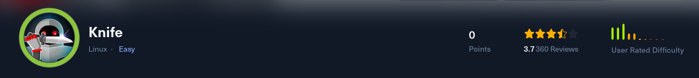
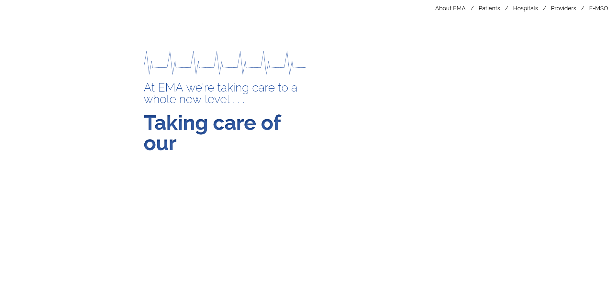
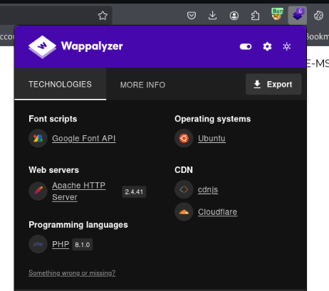
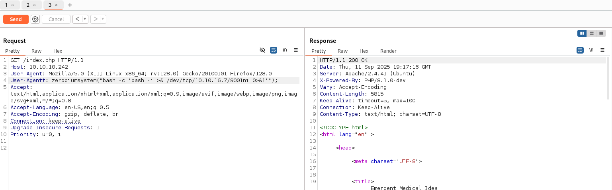
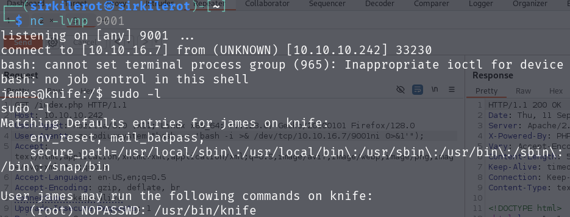
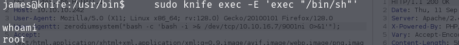
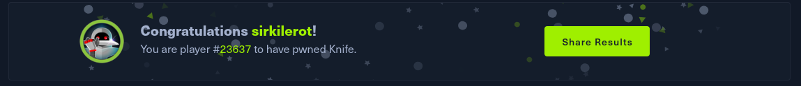

Knife – HackTheBox Writeup Knife

## Initial exploitation.
This box is quiet simple. It was exploited via vulnerability in old version of PHP and then privileges were escalated with binary that was executable for user.  
As always i began with an nmap enumeration that found that box was running ssh and http.  
Iwisited the http website however nothing of interest was found there as there were no interactive features or directories providing me with no attack surface.  
  
I tried directory enumeration but nothing of interest was found there.  
My last resort was to open wappalyzer and view technologies running on the website.  
Luckily the website was using PHP 8.1.0 and after some googling i found out that this version has a backdoor that allows RCE.  
  
  
This backdoor can be accessed by adding User-Agentt header and inside write zerodiumsystem("ls"); and command gets executed.  

  
  
To access this backdoor i captured request in burpsuite added header and BOOM i got user shell!  
## Privilege escalation  
Now i have shell running as user james and can grab user flag.  
My first idea was to use linpeas however when i tried to download it i got permision denied.  
Then after running sudo -l i found binary called knife that my user could run as superuser.  

  
  
Since the name of this executable is same as the name of the box this was hinting i was on right track.  
I did know what to do with this so i consulted it with chatgpt i nearly got there with chat but aat the end not really.  
Then i remembered website https://gtfobins.github.io/gtfobins/ where i searched up for this binary and got answer to how to misuse it.  
sudo knife exec -E 'exec "/bin/sh"'  
After running this i got my root privilege tho interface was kinda strange but nevermind.  

  

  

