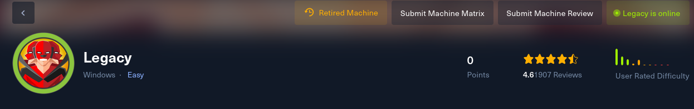
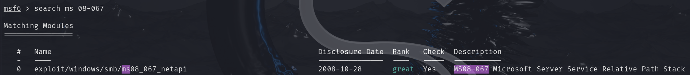

Legacy – HackTheBox Writeup legacy  

This box is not really worth a writeup as it is pretty much the same thing as [Blue](blue.md).   
All it takes is nmap scan then search for a rce this time it was windows xp with vulnerable smb.  
(MS08-067)  
But this time you use different exploit.  

That will give you also the root privileges.  

