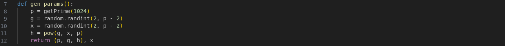
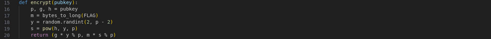
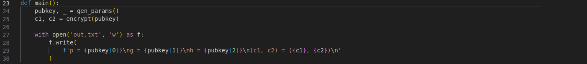
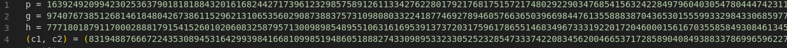
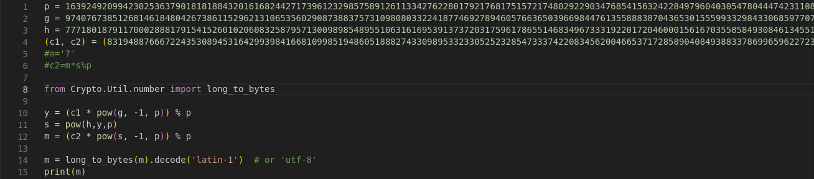

HTB - Gonna Lift Em All  
This is not a box  this is an easy difficulty crypto challenge.  
In this challenge i was given the chall.py file that contained code that encrypted the flag,  
and output.txt file providing me with some variables that were used for encryption of the message.  
#Header1 code analysis  

the first function creates random prime number p of 1024 bits,then g,x that are somwhere between 2 and p-2.  
and then creats h with power function. That means h = g**x%p .  
That is standard procedure of generating parameters in cryptography nothing special.  

this function turns flag into numeric format and assigns it to m variable.  
Creates parameter y same way as before  
and then paramter s by h**y%p  
then returns 2 values composed of these.  

Now the final function runs these functions assigns pubkey to parameters from first function and c1 and c2 to ressults of second function.  
Then prints some parameters that we are given in output.txt  
#H2 Decryption   
What we know is p g h c1 and c2 which is a lot and what we need to find is m.  

m is inside : c2=m*s%p   
to find m we use: m = (c2 * pow(s, -1, p)) % p   
s is calculated by : s = pow(h,y,p)       
y is inside : c1=g*y%p  
to find y we use: y = (c1 * pow(g, -1, p)) % p   
To put it in code ;  
  
That will calculate m.  
To put m from numerical value into flag format i used long_to_bytes and then turned bytes to letters using latin-1.  
I tried utf-8 first but that didnt work.  
