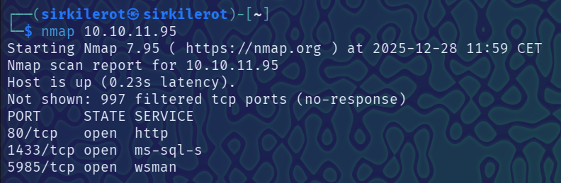
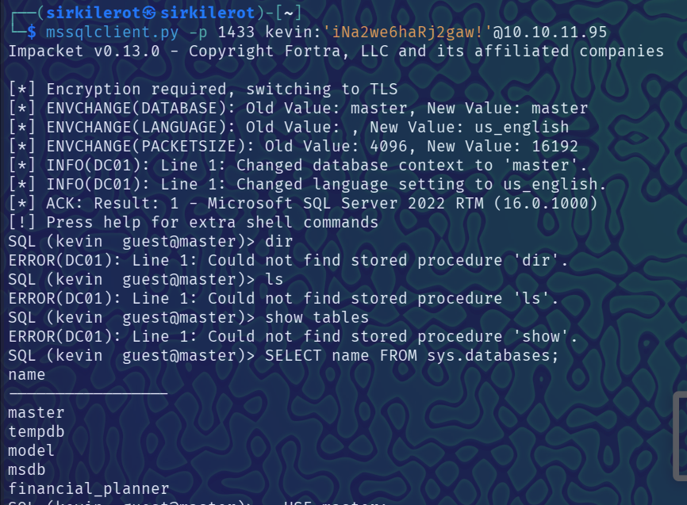
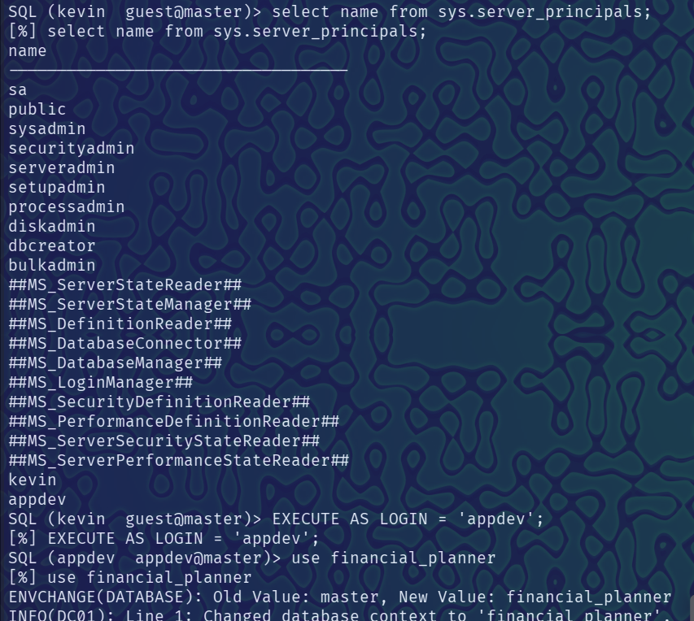
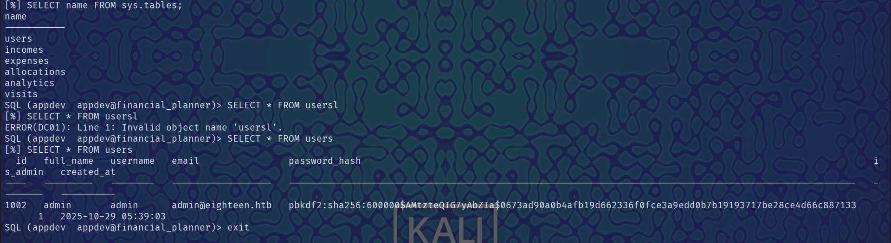
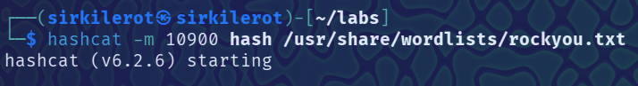
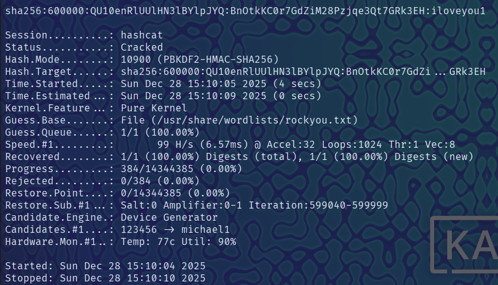
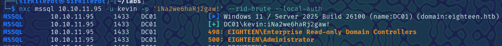
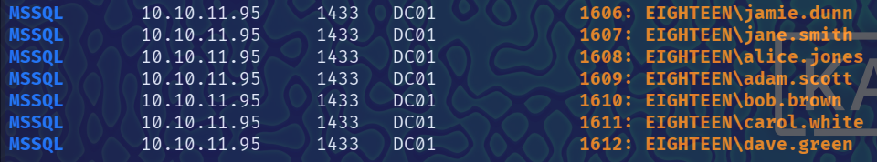
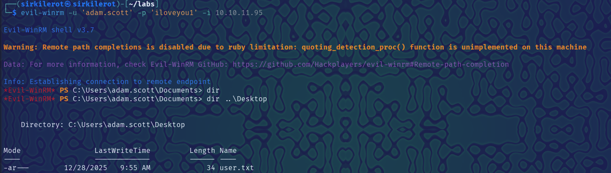

##Eighteen HTB Writeup

Eighteen is an easy difficulty windows machine that involved enumeration of mssql database and it was kinda frustrating and i didnt get root.
Also thats why this machine didn't recieve good rating.
I completed this machine while it was active during season 9 but i was kinda lost doing it and it took a lot of time to find out what to do actually.
## Initial foothold
I started with nmap scan.

The http was a total `dead end` it was there to provide context for the box but it wasted me time, i found some db credentials that weren't usable anywhere.
However for this machine i was provided credentials `kevin : iNa2we6haRj2gaw!` that allowed me to connect to the mssql database.

##Mssql

Inside the database there were basic tables and `financial_planner` table however as user kevin i was no allowed to use that.
After some enumeration of users i found out user names and as Claude suggested as one way to escalate privileges was to impersonate different user.

After trial and error i successfully impersonated appdev with `EXECUTE AS LOGIN = 'appdev';` and i accessed financial_planner.
I found the admin password hash.

The hash was PBKDF2-SHA256 however to crack it with hashcat i needed to change the format.
The correct format is `sha256:600000:base64(salt):base64(from.hex(hash))` only then you can crack it.

I thought it was over now. Little did i know the username was not admin, in fact i did not have username.
I used netexec to enumerate further.

It started listing directories and at the botom were leaked users from those `adam.scott` was the one whose credentials i obtained.
Now i used evil-winrm to connect and grabbed user flag.

## P.S
I tried escalating priveleges but unsuccessfully. You are supposed to use exploit known as BadSuccessor i tried setting it up and running however i did not get root.
