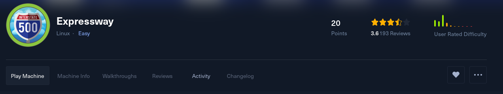
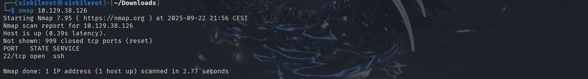
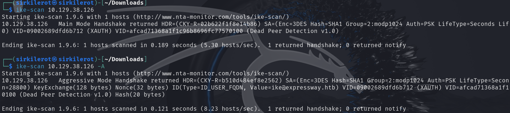
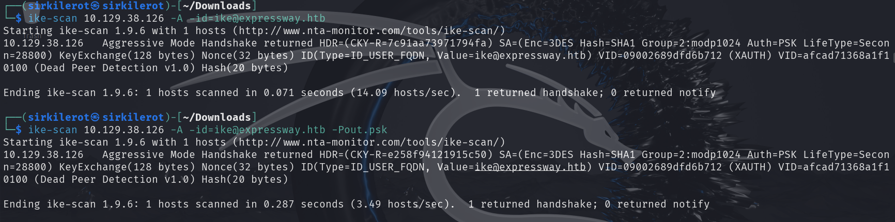
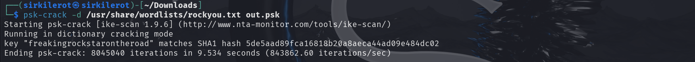
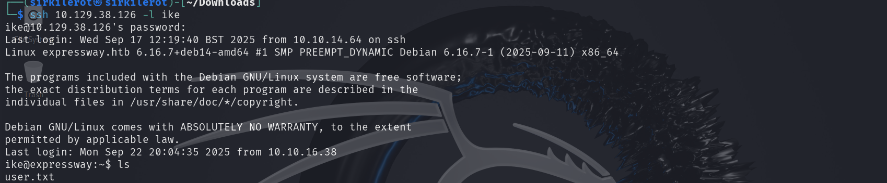
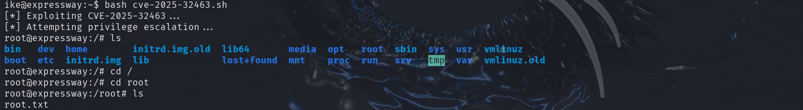

Expressway - HTB Writeup

This is an easy difficulty box that is exploited via ike and root was gained with basic CVE.
As firs i started with an nmap scan however it only revealed ssh so that is unsusual.
Since there were no other ports open that could serve as attack surface i tried to scan for `UDP` ports.

To reveal UDP ports i used following syntax `sudo nmap -sU -p 500,4500 10.129.38.126`  
This has revealed the service called ike on port 500. 
To find out more about ike we can use ike-scan tool.

Use `-A` for aggresive mode.
This reaveals `Value=ike@expressway.htb` so we have an ID and now we can try to get his password and hopefully ssh as this user. 

Now i scanned with the calid id and set output file `out.psk` 
Inside this file were successfully written handshake data that can be cracked. 

To crack them i used psk-crack with rockyou wordlist and got the password.

Now i could login via ssh and grab a user flag.
From now on the privilege escalation were pretty straight forward.

Sudo version was outdated so i just found a CVE and downloaded some POC.
Got root after execution

And there is the root flag !
