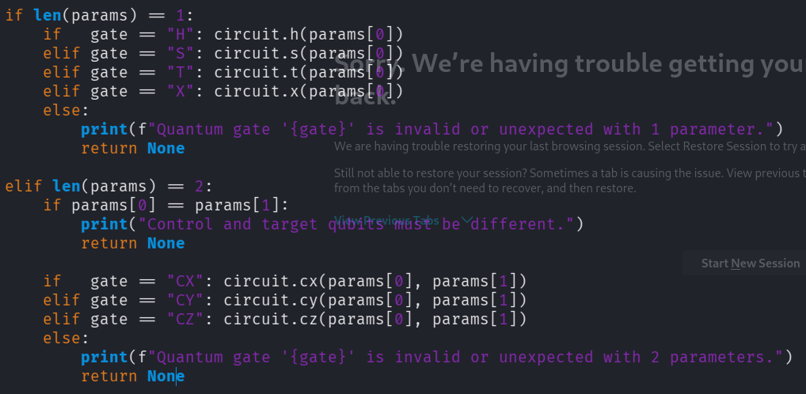
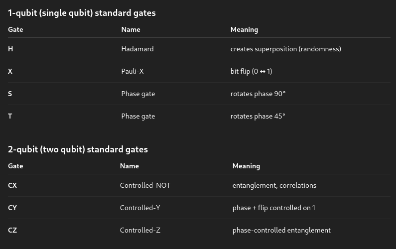
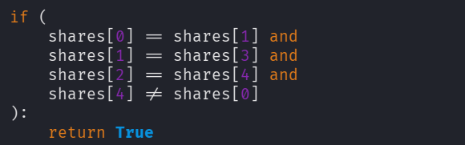

# Global Hyperlink Zone - HTB Writeup

This is a very easy quantum computing challenge.  
The Quantum category is a new challenge type on HTB.

In this challenge I was given a running Python server and its source code.  
The code uses the Qiskit module. Qiskit allows a regular program to utilize a quantum computer (or a simulator).

To get the flag, I needed to thoroughly understand the code. After that, the challenge turned into a simple logical puzzle.

## Source Code Analysis

The code starts by importing Qiskit modules that allow the program to work with quantum circuits.  
The program creates **5 circuits**, meaning I can manipulate 5 variables.  
The input format is defined to be logic operation followed by **:** then number of circuit to manipulate and **;** to start new operation.

For example: `H:2;CX:0,1`

Chat gpt here explained functions of these logic gates:

Using these commands, I can manipulate all 5 circuits.

This part defines the actual challenge:  
I have to make circuits **0, 1, and 3 the same**, and circuits **2 and 4 the same**, but **the two groups must be different**.

## Solution

I used gate **H** to initialize the first value, then used **CX** to link circuits 0, 1, 3, and 2.  
Then I used **X** to flip the value of circuit 2, and another **CX** to link circuit 2 with circuit 4.  
And bang — there goes the flag.
